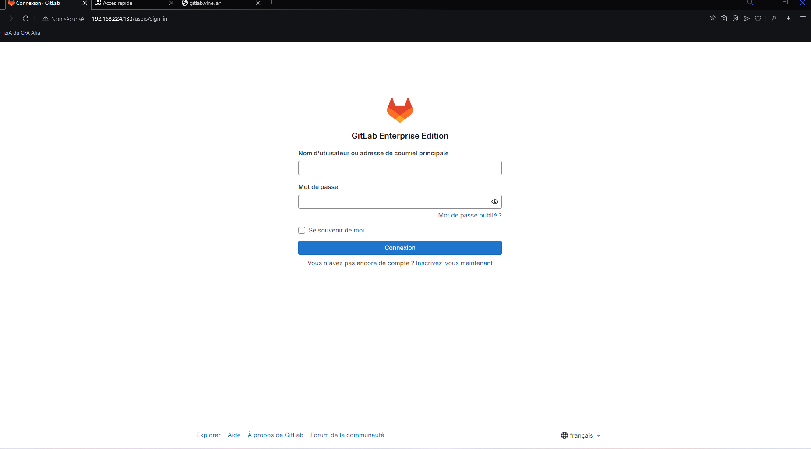

# Documentation du Projet Ansible : Déploiement GitLab et PostgreSQL

## Description du Projet

Ce projet utilise Ansible pour automatiser le déploiement d'une infrastructure composée de :
- **GitLab** : pour la gestion du code source.
- **PostgreSQL** : pour la base de données.

L'objectif est d'automatiser chaque étape du déploiement pour garantir une reproductibilité et une gestion centralisée de l'infrastructure.

---

## Structure des Rôles Ansible

### Rôle : `gitlab`
- **Variables** :
  - `gitlab_domain` : Nom de domaine pour accéder à GitLab.
  - `gitlab_storage_path` : Chemin de stockage pour les données GitLab.
- **Tâches principales** :
  1. Télécharger le script d'installation de GitLab.
  2. Exécuter le script pour configurer les dépôts nécessaires.
  3. Installer GitLab EE (Enterprise Edition).
  4. Configurer :
     - Domaine (`external_url`).
     - Port externe. (pas possible dans notre cas)
     - Chemin de stockage des données.
  5. Redémarrer GitLab après configuration.
- **Handler** :
  - Redémarrer GitLab avec `gitlab-ctl reconfigure`.

---

### Rôle : `bdd`
- **Variables** :
  Aucune variable spécifique n'est définie pour le rôle BDD.
- **Tâches principales** :
  1. Installer PostgreSQL.
  2. Configurer PostgreSQL :
     - Modifier `pg_hba.conf` pour permettre les connexions locales avec `trust`.
     - Remplacer `127.0.0.1/32` par `0.0.0.0/0` pour les connexions distantes.
  3. Créer des bases de données :
     - `all`, `dev`, `stage`, `prod`.
  4. Créer un utilisateur `vagrant` et lui attribuer :
     - Tous les privilèges sur `all`.
     - La propriété des bases `dev`, `stage`, `prod`.
- **Handler** :
  - Redémarrer PostgreSQL si la configuration est modifiée.

---

## Fichiers Importants

### Inventaire (`inventory.yml`)
Définit les hôtes cibles et leurs paramètres :
```yaml
all:
  children:
    gitlab:
      hosts:
        gitlab-server:
          ansible_host: 192.168.224.130
          ansible_user: root
    postgres:
      hosts:
        postgres-server:
          ansible_host: 192.168.224.131
          ansible_user: root
          ansible_python_interpreter: /usr/bin/python3
```
### Variables pour GitLab (`roles/gitlab/vars/main.yml`)

```yaml
gitlab_domain: gitlab.vlne.lan
gitlab_storage_path: "/var/opt/gitlab/git-data"
```
## Instructions pour l'Utilisation

1. **Prérequis :**
   - Ansible installé sur votre machine de contrôle.
   - Accès SSH configuré pour les hôtes cibles.

2. **Exécuter le Playbook :**

   ```bash
   ansible-playbook -i inventory.yml deploy_gitlab.yml
   ```

## Accéder à GitLab :

Une fois le playbook exécuté avec succès :
- Assurez-vous d'avoir configuré votre fichier `hosts` local (sous Linux : `/etc/hosts`, sous Windows : `C:\\Windows\\System32\\drivers\\etc\\hosts`) pour inclure l'entrée suivante l'ip de la machine gitlab:

    ```bash
        192.168.224.130 gitlab.vlne.lan
    ```

    
- Accédez à l'interface GitLab depuis votre navigateur en ouvrant `http://gitlab.vlne.lan`.

Vérifications supplémentaires :
- Si vous ne pouvez pas accéder à `http://gitlab.vlne.lan`, essayez de pinger l'adresse :
    ```bash
        ping gitlab.vlne.lan
    ````
